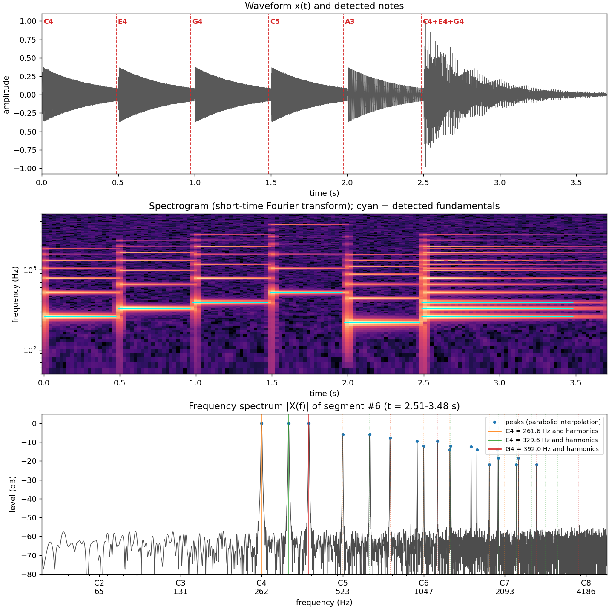

# Can mathematics recognise musical notes?

A Python program that listens to a short recording, breaks the sound into its
component frequencies with the **Fourier transform**, and names the notes that
were played – single notes, melodies, and simple chords.



```
$ python note_detector.py --demo
  #     time  note    frequency     tuning  harmonics
--------------------------------------------------------
  1    0.00s  C4        261.6Hz      -0 ct  7
  2    0.49s  E4        329.6Hz      -0 ct  7
  3    0.98s  G4        392.0Hz      -0 ct  7
  4    1.49s  C5        523.3Hz      -0 ct  7
  5    1.97s  A3        220.0Hz      -0 ct  7
  6    2.48s  C4        261.6Hz      +0 ct  8
               E4        329.6Hz      -0 ct  5
               G4        392.0Hz      +0 ct  3
```

## Quick start

```bash
pip install -r requirements.txt
python note_detector.py --demo                      # synthetic melody + C major chord
python note_detector.py --record 4 --save-audio me.wav   # record yourself (needs sounddevice)
python note_detector.py me.wav                      # analyse a recording
python note_detector.py me.wav --max-notes 1        # melody only: one note at a time
python note_detector.py me.wav --save result.png --segment 3
python note_detector.py --verify-dft                # the maths vs. the fast algorithm
python -m pytest                                    # 21 tests
```

**Recording tips:** a quiet room, phone or laptop mic 30–50 cm from the instrument,
play notes separately with a short gap, 2–10 seconds total. Record as WAV.

## The mathematics

### 1. A note is a sum of sine waves (trigonometry)

A plucked string vibrates at a fundamental frequency *f₀* **and** at whole-number
multiples of it (harmonics), so the sound is approximately

$$x(t) = \sum_{h=1}^{H} A_h \sin(2\pi h f_0 t + \varphi_h).$$

The pitch we hear is *f₀*; the relative sizes of the *A_h* are the timbre, which
is why a guitar and a piano playing the same note sound different.

### 2. Sampling

A microphone gives numbers *x[n] = x(n/f_s)* at a sample rate *f_s* (e.g. 44 100 Hz).
Only frequencies below the **Nyquist frequency** *f_s/2* can be represented.

### 3. The discrete Fourier transform

$$X[k] = \sum_{n=0}^{N-1} x[n]\, e^{-2\pi i k n / N}, \qquad k = 0,\dots,N-1.$$

By Euler's formula *e^{-iθ} = cos θ − i sin θ*, each *X[k]* measures how much the
signal correlates with a cosine and a sine at frequency *f_k = k f_s / N*. A peak in
*|X[k]|* means "there is a sine wave here". `naive_dft()` implements this formula
directly (*N²* operations); `np.fft` uses the Fast Fourier Transform (*N log N*).
`--verify-dft` shows they agree to ~10⁻¹³ while the FFT is hundreds of times faster.

### 4. Windowing and zero-padding

The DFT assumes the chunk of signal repeats forever. Cutting it abruptly creates
false frequencies (**spectral leakage**), so each chunk is multiplied by a Hann window
*w[n] = ½(1 − cos(2πn/(N−1)))*, which fades it in and out. Padding with zeros
before the FFT samples the spectrum more finely (it adds no new information, but it
makes peaks easier to locate).

**Frequency resolution** is about *1/T* for a chunk of length *T* seconds. The low
E string (82.4 Hz) is only ~4.9 Hz from its neighbour, so we need *T* ≳ 0.2 s:
a direct trade-off between time precision and frequency precision (the same
mathematics as Heisenberg's uncertainty principle).

### 5. Finding where notes start (short-time Fourier transform)

The program computes FFTs of overlapping 2048-sample frames (a **spectrogram**) and
measures the **spectral flux** – the total increase in (log) energy from one frame
to the next. A new note makes the flux spike; spikes above an adaptive
median threshold are onsets.

### 6. Sub-bin precision (numerical analysis)

A true frequency usually falls between two FFT bins. Fitting a parabola
*y = a(x−p)² + b* through the peak bin and its two neighbours (in dB) gives the
vertex offset

$$p = \frac{1}{2}\,\frac{y_{k-1} - y_{k+1}}{y_{k-1} - 2y_k + y_{k+1}},$$

which locates the peak to a small fraction of a bin (tested: < 0.1 bin error).

### 7. From peaks to notes: harmonic sums

The strongest peak is **not** always the note (a low guitar string's 2nd harmonic
is often louder than its fundamental – an "octave error"). Instead, for each
candidate *f₀* (each peak divided by 1, 2, 3, 4), we score how well it explains
the spectrum:

$$S(f_0) = \sum_{h} \frac{A_{\text{peak near } h f_0}}{h}.$$

The best candidate becomes a note; its refined frequency is a weighted
least-squares average of *f_peak / h*. For chords, its harmonics are removed and
the process repeats until the next candidate is weaker than 35 % of the first.

### 8. Frequency → note name (logarithms)

Equal temperament divides the octave (a doubling of frequency) into 12 equal
ratios of *2^{1/12}*. With A4 = 440 Hz = MIDI note 69:

$$m = 69 + 12\log_2\!\left(\frac{f}{440}\right).$$

Round *m* for the note name; the remainder × 100 is the tuning error in **cents**.

## Project structure

```
note_detector.py         the whole pipeline (≈ 450 lines, commented by section)
tests/                   pytest suite: notes, chords, tuning, octave errors, DFT
examples/demo.png|wav    output of --demo
```

## Limitations (good discussion points)

- **Octaves in chords**: C4 + C5 together looks like C4 alone, because every
  harmonic of C5 is also a harmonic of C4.
- **Piano inharmonicity**: stiff strings make upper partials slightly sharp of
  *h·f₀*; the 40-cent matching tolerance absorbs most of this for mid-range notes.
- **Fast passages** give short chunks and therefore poor frequency resolution.
- Vibrato, bends, reverb and background noise all blur the peaks.

## Ideas for extending it

- Compare against a tuner app and measure your accuracy in cents.
- Plot guitar vs. piano spectra of the same note and compare the harmonic amplitudes.
- Implement the Harmonic Product Spectrum or autocorrelation (YIN) and compare methods.
- Recognise chord names (C major, A minor …) from the detected notes.
- Real-time mode with `sounddevice.InputStream`.
